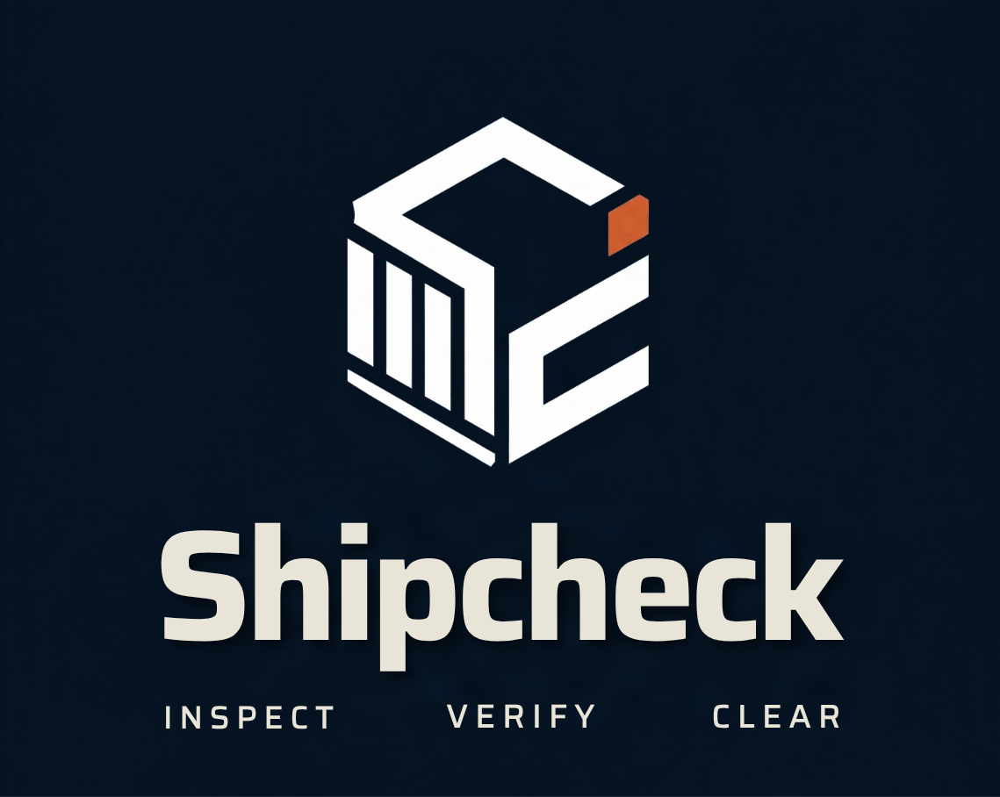
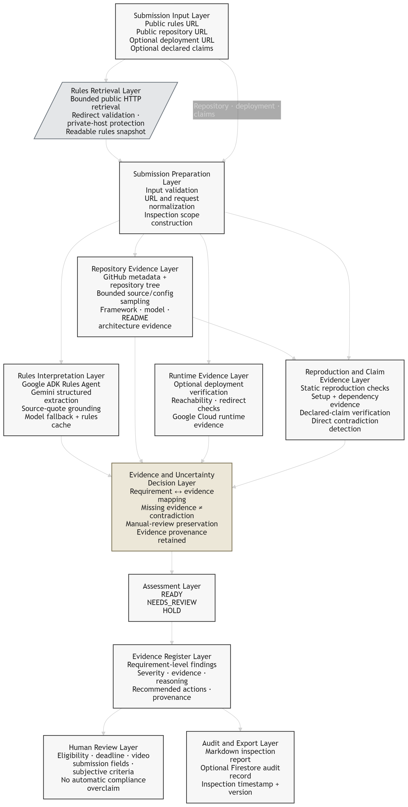
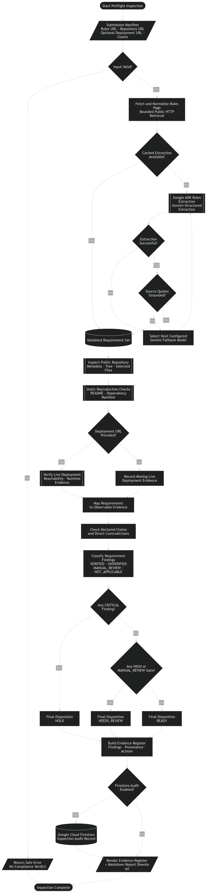
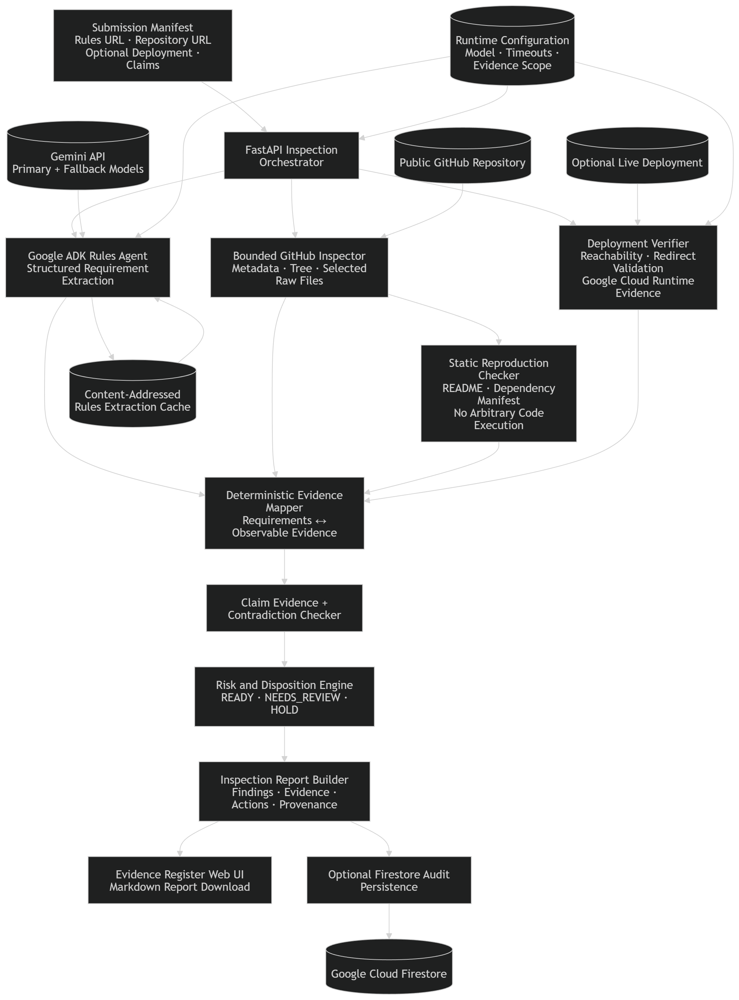

<p align="center">
  
</p>

<p align="center">
  <strong>Autonomous preflight for software submissions.</strong><br>
  Not cleared until proven.
</p>

# Shipcheck

Shipcheck is an evidence-first preflight inspector for software submissions.

Give it a competition rules page and a public repository. Shipcheck interprets explicit requirements with a Google ADK agent, inspects bounded repository and runtime evidence, checks declared claims, preserves uncertainty where automation cannot prove compliance, and returns one of three dispositions: `READY`, `NEEDS_REVIEW`, or `HOLD`.

The project was built for **All Things Agentic Hackathon · Taskmaster**.

`READY` means no unresolved blocker or review gate was found within the evidence Shipcheck could inspect. It is not a guarantee of eligibility, judge acceptance, or competition success.

## Why preflight?

A project can work perfectly and still fail at submission.

The architecture diagram may be missing. The README may not explain how to run the project. A deployment may be unreachable. A required framework may be claimed but not evidenced in the repository. One mandatory rule may simply have been overlooked.

Shipcheck is built around a narrower question:

> **Can this submission prove that it satisfies the rules?**

That distinction matters. Shipcheck does not ask Gemini to declare a project compliant and call it a day. The agent interprets rules; deterministic inspection services gather observable evidence; unresolved human-only requirements remain visible instead of being quietly converted into passes.

## What it does

- Accept a public competition rules URL.
- Accept a public GitHub repository URL.
- Accept an optional live deployment URL.
- Accept optional declared submission claims, one per line.
- Extract explicit requirements with a **Google ADK** rules agent and Gemini structured output.
- Ground extracted source quotes back to the fetched rules text before accepting an uncached extraction.
- Fall back across configured Gemini models when a model is unavailable, quota-limited, times out, or returns unusable grounded output.
- Inspect bounded GitHub metadata, repository trees, selected source files, configuration files, and documentation.
- Detect evidence for supported Google agent frameworks, Gemini model configuration, README setup instructions, architecture artifacts, and cloud/runtime signals.
- Run static reproduction checks without executing arbitrary untrusted repository code.
- Verify an optional public deployment for reachability and bounded runtime evidence.
- Check declared claims against repository and runtime evidence.
- Keep **missing evidence** separate from **direct contradiction**.
- Preserve rules requiring human judgment as `MANUAL_REVIEW`.
- Return `READY`, `NEEDS_REVIEW`, or `HOLD` through deterministic disposition logic.
- Render a requirement-level Evidence Register in the web interface.
- Export completed inspections as Markdown reports.
- Optionally persist inspection audit records to **Google Cloud Firestore**.

## Quick Start

Requires **Python 3.12.x**, [`uv`](https://docs.astral.sh/uv/), and a Gemini API key.

```bash
git clone https://github.com/panjiaryasoma/Shipcheck.git
cd Shipcheck

uv sync
```

Create the local environment file.

Windows PowerShell:

```powershell
Copy-Item .env.example .env
```

macOS / Linux:

```bash
cp .env.example .env
```

Add your Gemini API key to `.env`:

```dotenv
GEMINI_API_KEY=YOUR_GEMINI_API_KEY
```

Start the application:

```bash
uv run uvicorn app.main:app --reload
```

Open `http://127.0.0.1:8000/` in your browser.

Enter a public rules URL and repository URL, optionally add a deployment URL and declared claims, then select **Run preflight**. Completed reports can be downloaded directly as Markdown.

Interactive API documentation is available at `http://127.0.0.1:8000/docs`.

> Firestore is optional for the normal local path. Enable it only when inspection audit persistence is required.

## Core Inspection Flow



The end-to-end pipeline starts with the submission manifest and fans out into rules interpretation, repository evidence, runtime evidence, reproduction checks, and claim inspection. Those evidence channels converge before disposition so that the final assessment is based on observable support rather than a single model response.



The operational flowchart shows one inspection from input validation through rules extraction, model fallback, quote grounding, repository and deployment inspection, evidence classification, disposition, report generation, and optional Firestore persistence.

## Architecture



Shipcheck uses an intentionally hybrid architecture.

The **Google ADK agent** owns natural-language rules interpretation. Repository inspection, reproduction checks, deployment verification, evidence mapping, claim checking, contradiction handling, risk classification, and final disposition are deterministic application services around that agent.

This keeps semantic interpretation where it is useful without delegating the final compliance decision to an LLM.

## Disposition model

Shipcheck separates requirement status, severity, and final disposition.

| Disposition | Meaning |
|---|---|
| `READY` | No `CRITICAL`, `HIGH`, or `MANUAL_REVIEW` gate remains within the evidence Shipcheck could inspect. |
| `NEEDS_REVIEW` | No critical blocker remains, but at least one `HIGH` or `MANUAL_REVIEW` gate still requires attention. |
| `HOLD` | At least one `CRITICAL` finding remains unresolved. |

A disposition is an inspection result, not a promise that judges will accept the submission.

## Evidence model

Each extracted requirement is resolved into an evidence status rather than a generic pass/fail flag.

| Status | Meaning |
|---|---|
| `VERIFIED` | Observable evidence supports the requirement. |
| `UNVERIFIED` | The requirement is checkable, but sufficient proof was not found. |
| `MISSING` | A specifically expected artifact or value is absent. |
| `CONTRADICTED` | Available evidence directly conflicts with the requirement or declared claim. |
| `MANUAL_REVIEW` | Shipcheck cannot safely or objectively resolve the requirement automatically. |
| `NOT_APPLICABLE` | The extracted item is informational or does not require a compliance verdict. |

Severity is tracked independently as `PASS`, `WARNING`, `HIGH`, or `CRITICAL`.

This separation matters because absence is not contradiction. A repository that does not prove a claim is different from a repository that proves the claim false.

## Rules agent and Gemini

Rules interpretation runs through a **Google ADK** agent using Gemini structured output.

The normal model chain is environment-configurable. The repository defaults to:

```text
gemini-3.7-flash
gemini-3.6-flash
gemini-3.5-flash
```

Shipcheck records the model that actually completed an inspection and whether fallback was used.

Rules extraction is hardened by:

- bounded public-page retrieval;
- local/private-host rejection;
- redirect validation;
- response-size limits;
- structured output validation;
- source-quote grounding against the fetched rules snapshot;
- content-addressed rules caching;
- bounded per-model execution time;
- explicit fallback instead of silent degradation.

Formatting-only differences such as smart quotes, Unicode dashes, HTML entities, and whitespace normalization are tolerated during grounding. Paraphrased or invented evidence is not.

## Repository and reproduction inspection

Shipcheck does not clone and execute arbitrary public repositories.

The current inspector uses GitHub metadata and a bounded repository tree, then samples selected public source, configuration, and documentation files. File-count and file-size limits keep the inspection surface deliberate.

Static reproduction checks currently verify safely observable evidence such as:

- documented setup and run instructions in `README.md`;
- supported dependency manifests;
- repository artifacts already gathered by the bounded inspector.

Actual command execution remains `MANUAL_REVIEW` until a deliberately sandboxed execution path exists.

The repository inspector currently samples common Python, JavaScript/TypeScript, Go, Java, and Kotlin source/configuration files. Architecture filenames alone do not receive an automatic pass; architecture evidence must contain meaningful system or flow signals, while binary images remain reviewable artifacts.

## Deployment and Google Cloud evidence

An optional deployment URL can be checked for bounded public reachability and redirect behavior.

Shipcheck deliberately distinguishes **configuration evidence** from **live runtime evidence**. A `Dockerfile`, Cloud Run command, or `.run.app` string in documentation may show deployment intent, but does not prove that a live Google Cloud runtime exists.

A reachable deployment or other scoped live operation must be observed before Shipcheck treats runtime-specific requirements as verified.

## Firestore audit persistence

Shipcheck can optionally persist inspection reports to Google Cloud Firestore.

Authenticate Application Default Credentials:

```bash
gcloud auth application-default login
gcloud auth application-default set-quota-project YOUR_GOOGLE_CLOUD_PROJECT
```

Enable persistence before starting the application.

Windows PowerShell:

```powershell
$env:GOOGLE_CLOUD_PROJECT="YOUR_GOOGLE_CLOUD_PROJECT"
$env:SHIPCHECK_FIRESTORE_ENABLED="true"
$env:SHIPCHECK_FIRESTORE_DATABASE="(default)"
$env:SHIPCHECK_FIRESTORE_COLLECTION="shipcheck_inspections"
```

A successful write stores the inspection under its `inspection_id`.

### Cloud-evidence boundary

A Firestore write performed by Shipcheck is normally **inspector-runtime evidence**. It must not be used to prove that an unrelated repository uses Google Cloud.

Only Shipcheck self-inspection may promote that operation into target-project evidence, and only when the inspected repository matches:

```dotenv
SHIPCHECK_SELF_REPOSITORY_URL=https://github.com/panjiaryasoma/Shipcheck
```

This boundary prevents the inspector's own infrastructure from contaminating evidence about the project being inspected.

## Tech stack

| Layer | Technology |
|---|---|
| Backend | FastAPI |
| Agent framework | Google ADK |
| LLM integration | Gemini via Google Gen AI SDK |
| Rules retrieval | httpx + Beautiful Soup |
| Repository inspection | GitHub REST + bounded raw-file retrieval |
| Evidence and disposition | Deterministic Python services |
| Persistence | Google Cloud Firestore, optional |
| Frontend | Server-rendered HTML, CSS, vanilla JavaScript |
| Testing | pytest |
| Linting | Ruff |
| Python | 3.12.x |
| Container | Docker, Cloud Run-compatible configuration |

## Testing

Run linting and the full automated suite with:

```bash
uv run ruff check .
uv run pytest
```

The suite contains deterministic unit, integration, and acceptance coverage for rules extraction contracts, evidence semantics, GitHub inspection, deployment checks, reproduction behavior, Firestore persistence, disposition logic, and end-to-end fixtures.

## Project structure

```text
Shipcheck/
├── app/
│   ├── agent/
│   │   └── root_agent.py          # Google ADK rules agent
│   ├── core/
│   │   ├── config.py              # environment-backed settings
│   │   └── version.py             # runtime version source of truth
│   ├── models/                    # structured inspection contracts
│   ├── services/
│   │   ├── inspection.py          # end-to-end orchestrator
│   │   ├── live_repository.py
│   │   └── live_rules.py
│   ├── storage/
│   │   └── firestore.py           # optional audit persistence
│   ├── tools/
│   │   ├── live_rules.py          # bounded public rules fetcher
│   │   ├── github_repo.py         # bounded GitHub inspection
│   │   ├── reproduction.py        # static reproduction checks
│   │   ├── deployment.py          # deployment verification
│   │   ├── live_evidence.py       # requirement/evidence mapping
│   │   ├── contradiction.py       # claim + contradiction checks
│   │   └── risk.py                # final disposition logic
│   ├── web/
│   │   ├── templates/
│   │   └── static/
│   │       ├── asset/
│   │       ├── css/
│   │       └── js/
│   └── main.py
├── fixtures/                      # deterministic rules/repository fixtures
├── tests/
│   ├── unit/
│   ├── integration/
│   └── acceptance/
├── docs/
│   ├── 05_arch/                   # E2E, flowchart, architecture diagrams
│   ├── ARCHITECTURE.md
│   ├── PROBLEM_BRIEF.md
│   ├── REPO_STRUCTURE.md
│   └── SIMPLE_PRD.md
├── reports/
├── scripts/
├── submission/
├── Dockerfile
├── pyproject.toml
├── README.md
└── uv.lock
```

## API

The browser interface uses the same inspection service exposed through the FastAPI API.

Core endpoint:

```text
POST /api/inspect
```

Conceptual request:

```json
{
  "rules_url": "https://example.com/hackathon/rules",
  "repository_url": "https://github.com/example/project",
  "deployment_url": "https://project.example.com",
  "submission_claims": [
    "The project uses Google ADK.",
    "The backend runs on Google Cloud."
  ]
}
```

The response contains the inspection ID, final disposition, requirement-level findings, evidence, severity, reasons, recommended actions, and inspection notes used by the web Evidence Register.

Additional endpoints include:

```text
GET  /health
POST /api/rules/extract
GET  /api/fixtures/{fixture_name}/inspect
```

## Design principles

Shipcheck follows a few rules that are intentionally stricter than a flashy compliance demo needs to be:

- **The agent interprets rules; it does not own the final verdict.**
- **Evidence beats claims.** Declared capabilities do not become verified merely because they appear in text.
- **Missing evidence is not contradiction.** Direct conflicts require direct evidence.
- **Manual review is a valid result.** Human-only requirements are not forced into automated passes.
- **Configuration is not runtime proof.** Deployment files and commands are not treated as live infrastructure.
- **The inspector does not execute arbitrary repository code.** Static evidence remains bounded by design.
- **Inspector infrastructure must not contaminate target-project evidence.** Self-generated Firestore evidence is scoped explicitly.
- **Model provenance is recorded.** Reports expose the actual Gemini model and fallback state.
- **READY is scoped.** It means ready within the evidence Shipcheck could inspect.

## Limitations

Shipcheck is a hackathon prototype and should not be treated as a legal, eligibility, or submission-acceptance authority.

- Rules extraction depends on text that can be safely retrieved from public pages.
- JavaScript-heavy or inaccessible rule pages may expose incomplete readable text.
- Repository inspection is bounded and does not exhaustively read every file.
- Private repositories are not inspected by the current public-repository path.
- Arbitrary project commands are not executed.
- Subjective judging criteria, entrant identity, age, geography, deadlines, video quality, and submission-form state can require human review.
- A reachable deployment does not prove every backend component or claim.
- Firestore persistence is optional and requires valid Google Cloud credentials.
- `READY` is not a guarantee that a competition organizer or judge will accept the project.

## Documentation

Key project records include:

- [`docs/PROBLEM_BRIEF.md`](docs/PROBLEM_BRIEF.md)
- [`docs/SIMPLE_PRD.md`](docs/SIMPLE_PRD.md)
- [`docs/ARCHITECTURE.md`](docs/ARCHITECTURE.md)
- [`docs/REPO_STRUCTURE.md`](docs/REPO_STRUCTURE.md)
- [`docs/05_arch/E2E_Diagram.png`](docs/05_arch/E2E_Diagram.png)
- [`docs/05_arch/Flowchart.png`](docs/05_arch/Flowchart.png)
- [`docs/05_arch/Architecture.png`](docs/05_arch/Architecture.png)

---

<p align="center">
  <strong>Shipcheck</strong><br>
  Not cleared until proven.
</p>
