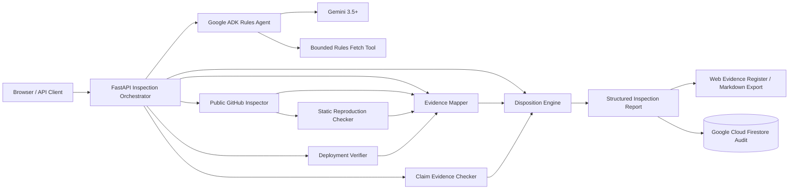

# Shipcheck Architecture

## Runtime topology



## Responsibility boundary

Shipcheck uses **one Google ADK agent**, but the ADK agent is not the owner of every
inspection operation.

The runtime is deliberately split as follows:

- **ADK rules agent**: retrieves the supplied rules page through a bounded function tool
  and converts explicit rules into structured requirements;
- **FastAPI inspection orchestrator**: coordinates the rules agent with deterministic
  repository, deployment, evidence, claim, risk, and persistence services;
- **repository inspector**: retrieves bounded public GitHub metadata, tree entries, and
  selected text files without executing repository code;
- **static reproduction checker**: verifies README setup markers and dependency-manifest
  evidence while leaving arbitrary command execution for manual review;
- **deployment verifier**: validates public targets and redirects before treating a final
  HTTP success response as reachable;
- **evidence mapper**: maps structured requirements to observed repository/runtime
  evidence;
- **claim evidence checker**: distinguishes direct contradiction from missing proof;
- **disposition engine**: produces `HOLD`, `NEEDS_REVIEW`, or `READY` from structured
  findings;
- **Firestore persistence**: optionally stores the final report as an audit record.

## Evidence flow

```text
Rules page
   |
   v
ADK + Gemini
   |
   v
structured requirements
   |
   +--------------------------+
   |                          |
   v                          v
repository evidence      deployment evidence
   |                          |
   +------------+-------------+
                |
                v
          evidence mapper
                |
                +---- declared-claim checks
                |
                v
        structured findings
                |
                v
         disposition engine
                |
                v
     inspection report + audit
```

## Google Cloud boundary

The current zero-billing path uses the project's default Google Cloud Firestore database
as persistent audit infrastructure. Enabled inspections write the structured report under
`shipcheck_inspections/{inspection_id}` using Application Default Credentials.

A Firestore operation performed by Shipcheck has explicit provenance scope:

```text
scope = inspector_runtime
```

That operation is **not** allowed to satisfy Google Cloud requirements for an unrelated
repository. It may be promoted into target-project evidence only during Shipcheck
self-inspection and only when the inspected repository matches
`SHIPCHECK_SELF_REPOSITORY_URL`.

The container remains Cloud Run-compatible. Docker/container configuration is repository
evidence only and is never treated as proof that a live Cloud Run runtime exists.

## Model and cache boundary

- the primary inspector model defaults to `gemini-3.7-flash`;
- bounded fallback models remain explicit in configuration;
- the report records the actual inspector model and whether fallback occurred;
- rules cache keys include both the rules URL and a digest of the fetched rules content;
- uncached model output is accepted only when every `source_quote` can be found in the
  fetched rules text.

## Safety constraints

- one ADK agent for MVP;
- every automated pass must point to evidence;
- unavailable evidence never silently becomes `PASS`;
- missing proof is not automatically a contradiction;
- architecture filenames alone are not sufficient automatic proof;
- public repository inspection is bounded by tree/file limits;
- selected repository source files are read but never executed;
- local/private URL targets are rejected;
- redirected rules and deployment targets are validated before following;
- Firestore persistence is opt-in and fails loudly when explicitly enabled;
- `.dockerignore` excludes local `.env` files from container build context.
